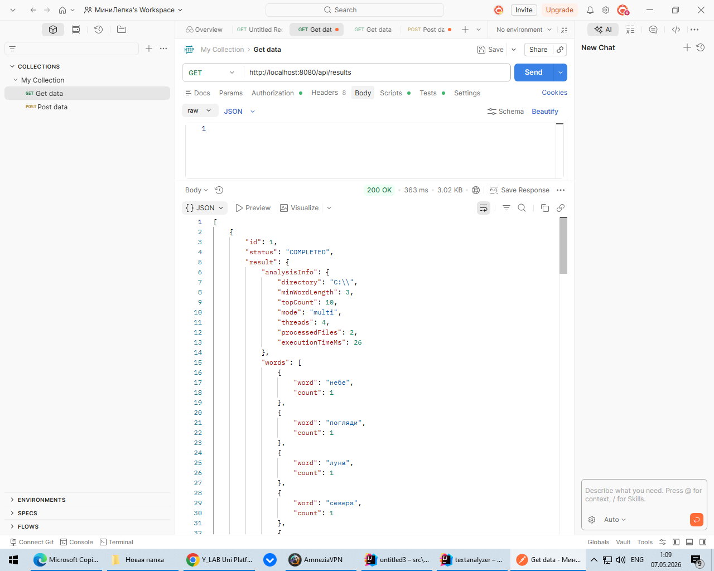
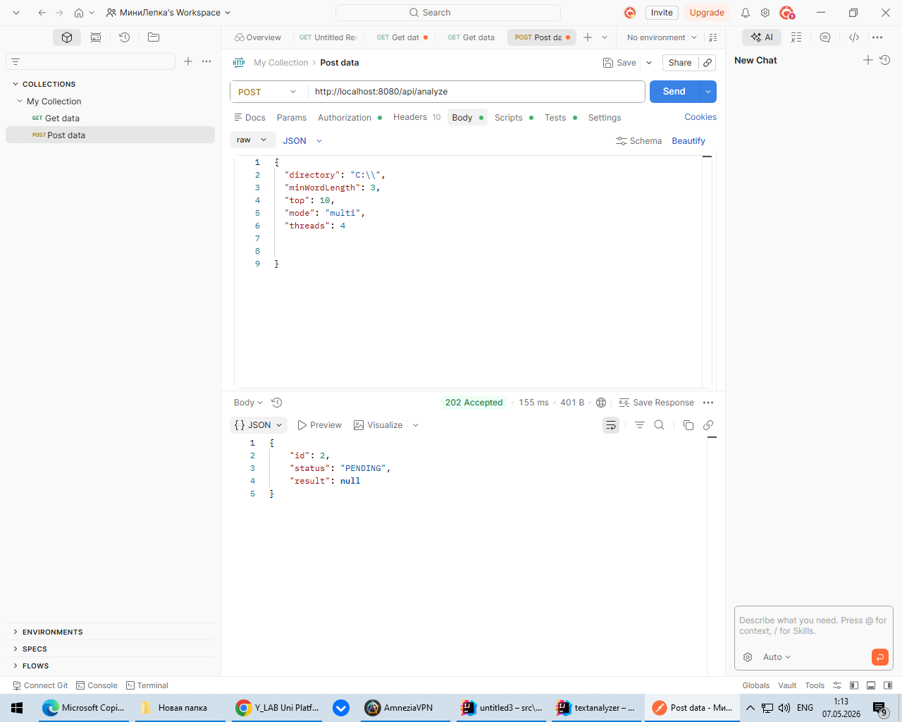

# Text-Analyzer
Консольное приложение для анализа текстовых файлов.

## Сборка
bash
mvn clean package
В результате будет создан  файл target/text-analyzer-3.5.14.jar.

## Запуск
1.Запустить можно из Idea: Run->Edit Configurations->Program Arguments
(указываем параметры например --dir C:\ --min-length 5 --top 10) будут прочитаны
все txt файлы из корня диска С. 

2.Можно через командную строку
для удобства создана папка exaplework, где лежат текстовые файлы и переименованный
файл text-analyzer.jar
Пример запуска может быть такой, если находимся в папке examlework.
.\examplework>java -jar text-analyzer.jar --dir .\ --min-length 5 --top 10 --stopwords ./stop.txt

## Результат
2026-04-28T23:29:42.244+07:00 DEBUG 11752 --- [textanalyzer] [           main] o.e.t.service.TextAnalysisServiceImpl    : Processing file: .\stop.txt
2026-04-28T23:29:42.247+07:00 DEBUG 11752 --- [textanalyzer] [           main] o.e.t.service.TextAnalysisServiceImpl    : Processing file: .\text1.txt
2026-04-28T23:29:42.274+07:00 DEBUG 11752 --- [textanalyzer] [           main] o.e.t.service.TextAnalysisServiceImpl    : Processing file: .\text2.txt
1. голос - 2
2. черты - 2
3. авроры - 1
4. безнадежной - 1
5. бледное - 1
6. вечор - 1
7. взоры - 1
8. виденье - 1
9. вьюга - 1
10. гений - 1

## Многопоточность
1.Были использованы следующие технологиии:Spring DI + @Qualifier
Позволяет внедрять разные реализации одного интерфейса (single и parallel) и выбирать стратегию выполнения в runtime.

ExecutorService (java.util.concurrent)
Основной механизм многопоточности:
Executors.newFixedThreadPool(threads) — пул фиксированного размера,
Future — получение результата от задач,
Callable — выполнение задач с возвратом значения.

ConcurrentHashMap
Потокобезопасная структура данных для объединения результатов анализа из разных потоков.

AtomicInteger
Используется в однопоточном режиме для корректного счёта обработанных файлов внутри лямбда‑выражений.

Java NIO (Files, Path)
Для:быстрого чтения файлов, сканирования директорий, работы с потоками файлов.

Jackson ObjectMapper
Для сериализации результата анализа в JSON.

2.Выбор:

Подход на основе ExecutorService + Callable + Future, потому что он:
2.1 Прост в реализации и контроле
   Пул потоков фиксированного размера позволяет:ограничить количество одновременно работающих потоков, 
избежать перегрузки CPU, контролировать жизненный цикл потоков.

2.2. Предсказуем по ресурсам
   В отличие от создания потоков вручную, пул:переиспользует потоки, снижает накладные расходы, 
стабильно работает на больших директориях.

2.3.Гарантирует корректность данных
   Использование:ConcurrentHashMap для глобального словаря, локальных HashMap внутри задач,
исключает гонки данных и обеспечивает потокобезопасность.

2.4. Хорошо масштабируется
   Каждый файл обрабатывается как независимая задача (FileProcessingTask), что идеально подходит для:
CPU-bound задач (анализ текста), большого количества файлов,
параллельного выполнения.

2.5.Легко расширяется
   Можно:менять размер пула, заменять ExecutorService на ForkJoinPool, использовать CompletableFuture.

3.Масштабирование:

-увеличить количество потоков (--threads N),
-применять ForkJoinPool для более эффективного распределения задач.
-вынести обработку файлов в отдельные микросервисы,
-использовать очередь задач (Kafka, RabbitMQ),
-запускать обработку на нескольких узлах,
-агрегировать результаты в централизованном хранилище.

## Запуск и результаты работы многопосного приложения

Для удобства создана папка exaplework, где лежат текстовые файлы и переименованный
файл для многопоточки text-analyzerThreads.jar
Пример запуска может быть такой, если находимся в папке examlework.
.\examplework>java -jar text-analyzerThreads.jar --dir .\ --min-length 5 --top 10 --mode multi --threads 5

## Результат
Для одного потока
.\examplework>java -jar text-analyzerThreads.jar --dir .\ --min-length 5 --top 10 --mode single

2026-05-01T12:38:08.654+07:00 DEBUG 7768 --- [textanalyzer] [  restartedMain] o.e.t.service.TextAnalysisServiceImpl    : Processing file: \text4.txt
Mode: single (1 workers)
Processed 28 files in 37 ms
1. голос — 24
2. нежный — 19
3. черты — 18
4. виденье — 15
5. мгновенье — 15
6. глуши — 12
7. деревне — 12
8. думать — 12
9. знала — 12
10. когда — 12

Process finished with exit code 0

Для многопотного
.\examplework>java -jar text-analyzerThreads.jar --dir .\ --min-length 5 --top 10 --mode multi --threads 5

2026-05-01T12:40:21.842+07:00  INFO 7388 --- [textanalyzer] [  restartedMain] o.e.t.TextAnalyzerApplication            : Started TextAnalyzerApplication in 2.43 seconds (process running for 3.793)
2026-05-01T12:40:21.849+07:00  INFO 7388 --- [textanalyzer] [  restartedMain] o.e.textanalyzer.cli.TextAnalyzerRunner  : ������ �������: dir=\, minLength=5, top=10, stopwords=null, output=null
Mode: multi (5 workers)
Processed 28 files in 23 ms
1. голос — 24
2. нежный — 19
3. черты — 18
4. мгновенье — 15
5. виденье — 15
6. хранитель — 12
7. глуши — 12
8. неопытной — 12
9. сердца — 12
10. деревне — 12

Process finished with exit code 0

## Вывод
Для многопоточного приложения процесс происходит быстрее, разница будет увеличиваться с ростом числа файлов и их размера.

## Создание Rest сервиса

**Приложение должно:**

1. Запускать анализ текстов через API (`POST /api/analyze`) с передачей параметров анализа в теле запроса.

2. Предоставляет возможность получать результаты конкретного анализа (`GET /api/results/{id}`) и список всех прошлых анализов (`GET /api/results`).

   1. Если анализ ещё не завершён, GET /api/results/{id} должен возвращать статус выполнения (PENDING, RUNNING и т.д.) вместо результатов.

3. Сохраняет результаты анализов в базу данных (параметры анализа, слова с частотой, ошибки, время выполнения) с уникальным идентификатором для каждого анализа.

4. Обеспечивает безопасность: доступ к API только авторизованным пользователям (**Spring Security**).

5. Ведёт аудит действий пользователей: кто, когда и с какими параметрами запускал анализ; хранит данные в БД.

6. Использует многопоточную обработку файлов из Этапа 2.

7. Возвращает результаты в единый JSON-формат, совместимый с Этапами 1–2.
## Запуск
Запускаем приложение. Работает на порту 8080.
Работаем через Postman.

Тесты пройдены.
Hibernate: insert into analysis_words (analysis_id,count,word,id) values (?,?,?,default)
Hibernate: insert into analysis_words (analysis_id,count,word,id) values (?,?,?,default)
Hibernate: insert into audit_log (action,analysis_id,details,timestamp,username,id) values (?,?,?,?,?,default)
Hibernate: update analyses set created_at=?,directory=?,execution_time_ms=?,min_word_length=?,mode=?,processed_files=?,status=?,threads=?,top_count=?,username=? where id=?
Hibernate: select ae1_0.id,ae1_0.created_at,ae1_0.directory,ae1_0.execution_time_ms,ae1_0.min_word_length,ae1_0.mode,ae1_0.processed_files,ae1_0.status,ae1_0.threads,ae1_0.top_count,ae1_0.username from analyses ae1_0 where ae1_0.username=?
Hibernate: select w1_0.analysis_id,w1_0.id,w1_0.count,w1_0.word from analysis_words w1_0 where w1_0.analysis_id=?
Hibernate: select e1_0.analysis_id,e1_0.id,e1_0.file,e1_0.message from analysis_errors e1_0 where e1_0.analysis_id=?
2026-05-07T01:15:31.895+07:00  INFO 5628 --- [textanalyzer] [ionShutdownHook] o.s.b.w.e.tomcat.GracefulShutdown        : Commencing graceful shutdown. Waiting for active requests to complete
2026-05-07T01:15:31.908+07:00  INFO 5628 --- [textanalyzer] [tomcat-shutdown] o.s.b.w.e.tomcat.GracefulShutdown        : Graceful shutdown complete
2026-05-07T01:15:31.918+07:00  INFO 5628 --- [textanalyzer] [ionShutdownHook] j.LocalContainerEntityManagerFactoryBean : Closing JPA EntityManagerFactory for persistence unit 'default'
2026-05-07T01:15:31.925+07:00  INFO 5628 --- [textanalyzer] [ionShutdownHook] com.zaxxer.hikari.HikariDataSource       : HikariPool-1 - Shutdown initiated...
2026-05-07T01:15:31.935+07:00  INFO 5628 --- [textanalyzer] [ionShutdownHook] com.zaxxer.hikari.HikariDataSource       : HikariPool-1 - Shutdown completed.

Process finished with exit code 0
